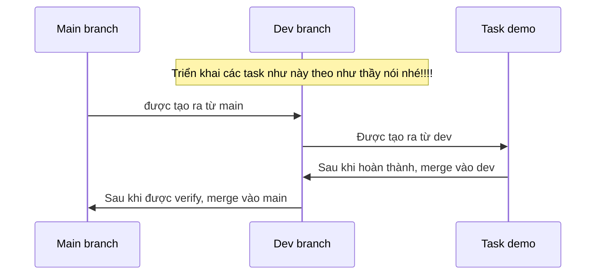

## REACTJS PROJECT 

- node version: nodejs v16.20.0
- api-port: 3001
- gui-port: 3000

### 1. How to run API
```
    cd /api-reactjs-project
    npm install
    npm run start:dev
```

### 2. How to run GUI
```
    cd /gui-reactjs-project
    npm install
    npm run dev
```

### 3. How to DEV
